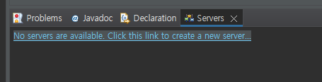

## 2023.07.27 수업 정리

### `데이타베이스 개요`

### `기본 SELECT문`

### `단일행 함수`

---

#### `desc` 테이블 보여줌 describe 약자

NULL -> 자격이 없다 OR 미확정

EX) President는 상사를 가질 자격이 없다는 뜻

EMPNO - 기본키(PRIMARAY KEY)

ENAME, JOB, MGR, HIREDATE, SAL, COMM - 일반키 , 일반 속성

DEPTNO - 외래키(FOREIGN KEY) . . . 해당 키 때문에 EMP TABLE과 DEPT TABLE이 RELATION 가짐

ROW(행) = TUPLE = RECORD

COLUMN(열)

FIELD = DATA 값

행 & 열 = 2차원 구조 = 테이블 = 엔터티

Relational - 정형 데이터

Document - 비정형 데이터, 비구조화된 데이터 ex) 음성 , 이미지 , 자연어

### `SELECT와 DML의 차이점`

INSERT, DELETE, UPDATE (DML) - ACCESS TO DB

SELECT (QUERY) - GET THE INFO FROM DB

### <b>방향의 차이 !</b>

